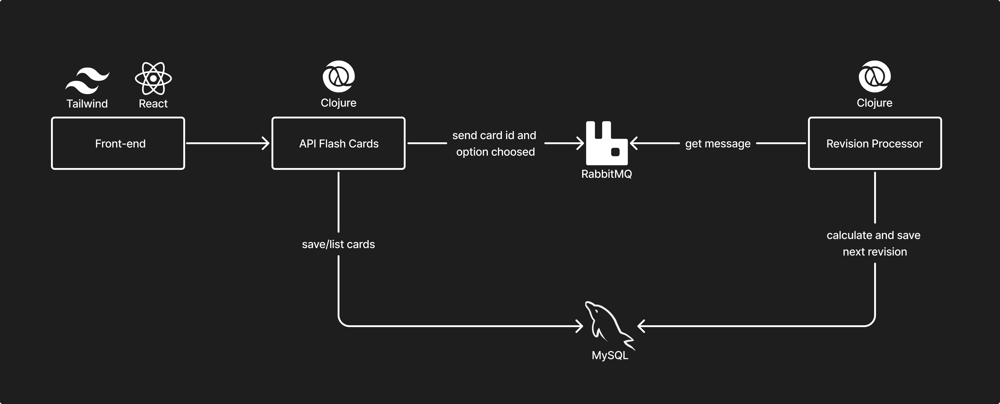

# Spaced Repetition Flashcards Study System

This project is a study application based on the **spaced repetition** technique using **flashcards**. The application allows users to create and periodically review flashcards, optimizing knowledge retention over time.

## Main Features

- **Flashcard Creation and Management**: Users can create, list, and view flashcards for study in an intuitive interface.
- **Spaced Repetition**: The system uses the spaced repetition technique to ensure that flashcards are reviewed at optimal times, based on the user's progress and performance.
- **Review Processing Microservice**: A dedicated microservice listens to a **RabbitMQ** queue, processes user reviews, and adjusts future reviews accordingly.

## System Architecture

The application consists of three main components:

1. **Front-end**
   - A user-friendly interface where users can create new cards, view existing ones, and perform reviews.
   
2. **API (Flashcard CRUD)**: 
   - Responsible for creating, listing, and managing flashcards, exposing **REST** endpoints for interaction with flashcard data.

3. **Review Processing Microservice**:
   - Connected to **RabbitMQ**, this microservice consumes messages from the queue, containing user-performed reviews.
   - It processes the reviews and adjusts the review intervals according to the fibonacci sequence.



## How to Run the Project

### Requirements

- Docker
  
### Steps to Run

1. Clone the repository:
   ```bash
   git clone https://github.com/your-username/your-project.git
   ```
2. Navigate to the project folder:
   ```
   cd spaced-repetition
   ```
4. Run the following command to start the application using Docker Compose:
   ```
   docker-compose up --build
   ```

## Contributions

Contributions are welcome! Feel free to open issues and pull requests.