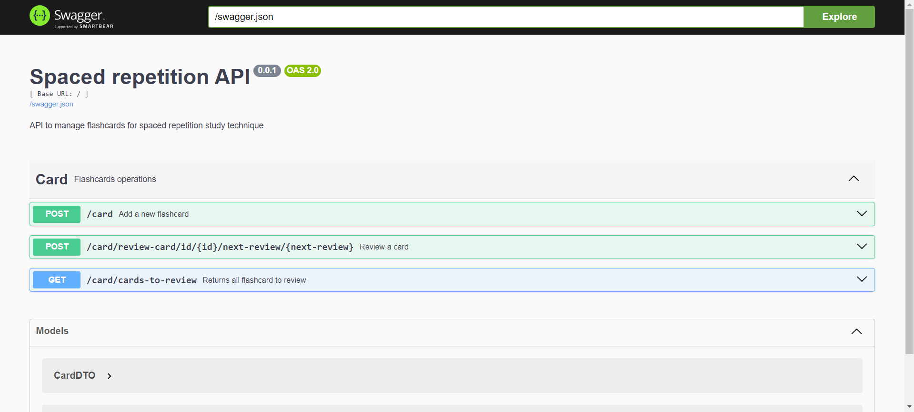

# Flashcards API - Spaced Repetition System


This is the **Flashcards API** for a spaced repetition study system. The API allows users to create new flashcards, list available cards for review, and review a card.



## Main Features

- **Create Flashcards**: Endpoints for creating new flashcards with relevant information.
- **List Flashcards for Review**: Endpoints for retrieving flashcards that are due for review based on spaced repetition algorithms.
- **Process Reviews**: After a card is reviewed, the API sends a message to a message queue (RabbitMQ) for further processing by a review microservice.

## How to Run the Project

### Requirements
- JDK
- Leiningen (https://leiningen.org/)
- Docker

### Steps to Run

1. Clone the repository:
   ```bash
   git clone https://github.com/your-username/flashcards-api.git
   ```

2. Navigate to the project folder:
   ```
   cd flashcards-api
   ```

3. Run the following command to start the application using Docker Compose:
   ```
   docker-compose up -d
   ```

4. **Connect to the database** and execute the commands found in the `scripts.sql` file to create the database schema.

5. To run the API in Clojure, run the command below inside the project directory:
   ```
   lein run
   ```