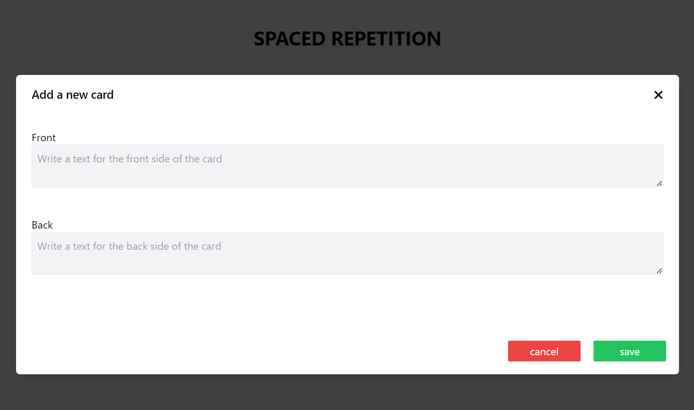

# Flashcards Frontend - Spaced Repetition System


This is the **Flashcards Frontend** for the spaced repetition study system. It allows users to interact with flashcards by creating new ones, listing available cards for review, and marking cards as reviewed.



## Main Features
- **Create Flashcards**: Interface to create new flashcards with a question and answer.
- **List Flashcards**: View flashcards that are due for review based on the spaced repetition system.
- **Review Flashcards**: Mark flashcards as reviewed and send the review result for processing by the backend API.

## How to Run the Project
### Requirements
- Node - NPM

### Steps to Run

1. Clone the repository:
   ```bash
   git clone https://github.com/GuiPM001/spaced-repetition.git
   ```

2. Navigate to the project folder:
   ```bash
   cd spaced-repetition/spaced-repetition-front
   ```

4. Install the dependencies
   ```bash
   npm install
   ```

5. To run project, run the command below inside the project directory:
   ```bash
   npm run
   ```
6. Once the services are running, **access the front-end** by navigating to [http://localhost:3000](http://localhost:3000) in your browser.